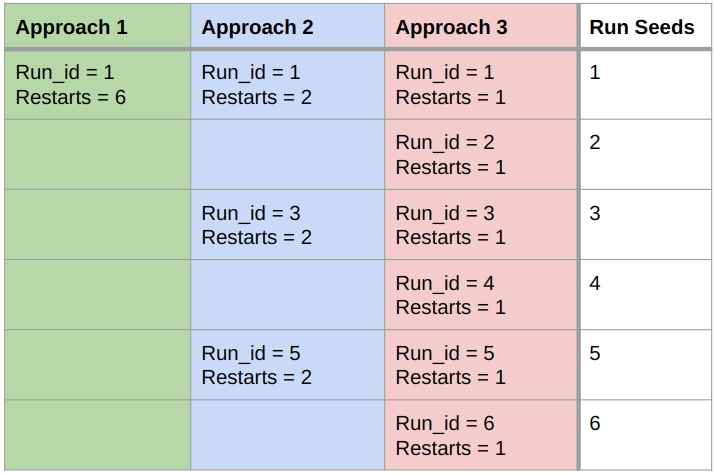

# Bayesian Active Learning By Distribution Disagreement

## Dependencies
Python >= 3.10 

Via pip:
- torch
- torchvision
- gym
- tqdm
- matplotlib
- Pandas
- scikit-learn
- zuko
- scipy
- faiss-cpu
- PyYAML
- ray\[tune\] (Optional)

## Quick Start
[Optional] Pre-download all datasets `download_all_datasets.py --data_folder <your_folder>`\
`--data_folder` sets the folder, where dataset files will be downloaded to \
You can run an evaluation with `evaluate.py --data_folder "<my_folder>" --agent <name> --dataset <name> --query_size <int>`\
Available Agents:
- `random`
- `coreset` (CoreSet Greedy)
- `typiclust`
- `coregcn`
- `bald`
- `balsa_kl_pairs`
- `balsa_kl_grid`
- `balsa_emd`
- `bald_dist_entropy`
- `bald_dist_std`
- `nflows_out`

Available Datasets:
- `pakinsons`
- `diamonds`
- `sarcos`
- `superconductors`

## Visualizations
All graphics from the paper are generated via the two notebooks `eval_plots.ipynb`.

## Parallel Runs
Parallelism is controlled by two parameters: `run_id`(default 1) and `restarts`(default 50)\
This starts one run with seed 1 that sequentially executes the evaluation 50 times. \
For full parallelism set `restarts` to 1 and execute 50 runs with increasing `run_ids`\
This will automatically collect the results after each finished run and store it in `<dataset>/<query_size>/<agent>/accuracies.csv`

Here is an example how to run 6 seeded runs with three different levels of parallelism \


### Run Scripts
The main run script is called `evaluate.py`. \
It implements the basic reinforcement learning flow and wraps the environment into a logging context manager:
```python
with core.EnvironmentLogger(env, log_path, util.is_cluster) as env:
    done = False
    dataset.reset()
    state = env.reset()
    iterations = math.ceil(env.env.budget / args.query_size)
    iterator = tqdm(range(iterations), miniters=2)
    for i in iterator:
        action = agent.predict(*state)
        state, reward, done, truncated, info = env.step(action)
        iterator.set_postfix({"accuracy": env.accuracies[1][-1]})
        if done or truncated:
            # triggered when sampling batch_size is >1
            break
```
The run script will collect all intermediate results and aggregate them into one `accuracies.csv` and `losses.csv` per experiment.
